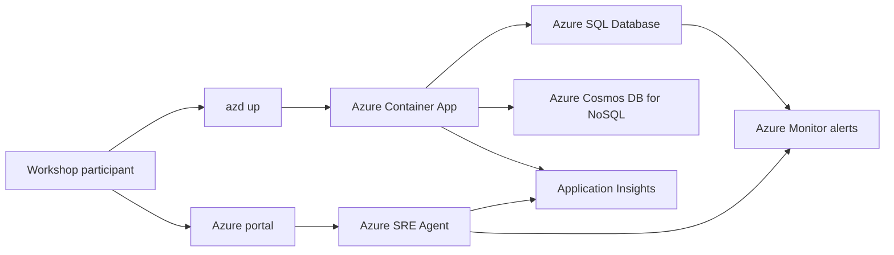

# Azure SRE Agent Workshop Demos

このリポジトリは、Azure SRE Agent の動作確認とハンズオンワークショップ向けのデモ環境をまとめたものです。ワークショップでは、Azure リソースとアプリケーションを azd でプロビジョニングし、Azure SRE Agent 自体は Azure portal で手動作成し、最後にスクリプトで意図的な障害や性能劣化を発生させて調査を行います。

## このリポジトリで扱う流れ

| フェーズ | 実施方法 | このリポジトリでの扱い |
|---|---|---|
| 1. アプリ基盤の作成 | azd | Bicep と azd フックで自動化 |
| 2. Azure SRE Agent の作成と設定 | Azure portal | 意図的に手動手順として分離 |
| 3. インシデントの再現と調査 | PowerShell スクリプト + Azure portal + Azure SRE Agent | シナリオごとの README に詳細を記載 |


## 学習目標

- azd の単一コマンドで、Azure リソース作成とアプリデプロイを一貫して実行する
- Azure SRE Agent を別リソースとして作成し、監視対象のリソースグループを関連付ける
- Application Insights、Azure Monitor、Azure SRE Agent を使って依存関係単位で障害を切り分ける
- Agent Canvas でカスタムエージェントとスキルを作成し、ドメイン特化の調査を自動化する
- Agent Playground でカスタムエージェントの動作をテストし、品質を評価する
- 一時回避と恒久対策を分けて議論できるワークショップを実施する

## 現在のシナリオ

| シナリオ | 目的 | 主な Azure サービス | 手順 |
|---|---|---|---|
| db-latency | Azure SQL と Cosmos DB のどちらが遅延の主因かを切り分ける | Azure Container Apps, Azure SQL Database, Azure Cosmos DB for NoSQL, Application Insights, Azure Monitor, Azure SRE Agent | [db-latency/README.md](db-latency/README.md) |

## 前提条件

- Azure サブスクリプション
- Azure CLI の最新安定版
- Azure Developer CLI の最新安定版
- PowerShell 7.4 以上
- Microsoft Entra の職場または学校アカウント
- Azure SRE Agent の利用権限

次の条件も重要です。

- Azure SRE Agent の作成では、少なくとも `Microsoft.Authorization/roleAssignments/write` が必要です。Microsoft Learn では、Role Based Access Control Administrator または User Access Administrator が案内されています。
- Azure SRE Agent のポータル利用に備えて、ネットワークやファイアウォールで `*.azuresre.ai` を許可してください。
- このリポジトリの azd フックは `az ad signed-in-user show` を利用して Azure SQL の Microsoft Entra 管理者を自動設定するため、ユーザー アカウントでのサインインを前提にしています。
- Azure SQL は Microsoft Entra-only authentication を有効化してデプロイします。デプロイ時に SQL 管理者パスワードは作成しますが、ワークショップ中のデータベース初期化や接続確認は Microsoft Entra トークンで行います。
- Cosmos DB for NoSQL はキー認証を無効化し、データプレーン RBAC とマネージド ID でアクセスします。

## アーキテクチャ概要



## リポジトリ構成

```text
SREAgentDBDemo/
├── README.md
└── db-latency/
	├── azure.yaml
	├── infra/
	├── scripts/
	└── src/
```

- `azure.yaml`: azd のエントリポイントです。Container Apps へのデプロイ設定と preprovision/postdeploy フックを定義しています。
- `infra/`: Bicep テンプレートです。アプリ基盤を作成します。
- `scripts/`: 負荷注入、初期化、blocking 再現のための PowerShell スクリプトです。
- `src/`: .NET 10 ベースのサンプル API です。

## ワークショップの進め方

1. 参加者は [db-latency/README.md](db-latency/README.md) の手順に従って `azd up` を実行し、対象アプリをデプロイします。
2. ファシリテーターまたは参加者が Azure portal で Azure SRE Agent を作成し、ワークショップ用のリソースグループを監視対象に追加します。
3. スクリプトで負荷や blocking を再現し、Application Insights と Azure SRE Agent の両方から原因を切り分けます。

## 補足

- `db-latency` シナリオは Azure Container Apps を使います。Bicep の一部出力名は `appServiceName` / `appServiceUrl` のままですが、実体は Container App です。
- `azure.yaml` では ACR の remote build を使っているため、既定のワークショップ手順ではローカル Docker デーモンは必須ではありません。
- `db-latency` の注文系 API は、環境変数の切り替えなしで意図的な常時スロークエリを含む実装です。追加の障害注入操作なしで調査を開始できます。
- Azure SRE Agent のリソース グループは、監視対象アプリのリソース グループとは分けて作成する構成を推奨します。これは Microsoft Learn の作成フローとも整合します。

## 公式ドキュメント

- Azure Developer CLI: https://learn.microsoft.com/azure/developer/azure-developer-cli/azd-up-workflow
- Azure Developer CLI PowerShell hooks: https://learn.microsoft.com/azure/developer/azure-developer-cli/powershell-guidance
- Azure SRE Agent の作成と利用: https://learn.microsoft.com/azure/sre-agent/usage
- Azure SRE Agent の権限: https://learn.microsoft.com/azure/sre-agent/permissions
- Azure SRE Agent のユーザー ロール: https://learn.microsoft.com/azure/sre-agent/user-roles
- Azure SRE Agent のカスタムエージェント（サブエージェント）: https://learn.microsoft.com/azure/sre-agent/sub-agents
- Azure SRE Agent のスキル: https://learn.microsoft.com/azure/sre-agent/skills
- Azure SRE Agent の Agent Playground: https://learn.microsoft.com/azure/sre-agent/agent-playground
- Azure SRE Agent のワークフロー自動化: https://learn.microsoft.com/azure/sre-agent/automate-workflows
- Azure SQL の Microsoft Entra 認証: https://learn.microsoft.com/azure/azure-sql/database/authentication-aad-overview
- Azure Cosmos DB for NoSQL の RBAC: https://learn.microsoft.com/azure/cosmos-db/how-to-connect-role-based-access-control
- Application Insights の失敗調査とトランザクション診断: https://learn.microsoft.com/azure/azure-monitor/app/failures-performance-transactions
