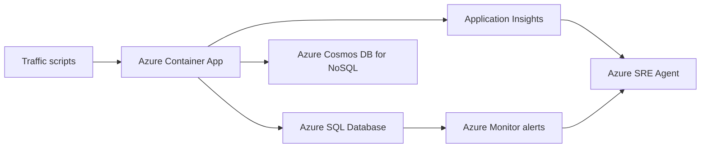

# シナリオ: Azure SQL と Cosmos DB の遅延増を切り分ける

このシナリオでは、API 全体が遅いように見える状況を再現し、実際には Azure SQL 側がボトルネックで Cosmos DB 側は正常であることを切り分けます。Azure SRE Agent、Application Insights、Azure Monitor を横断して、依存関係単位で原因を特定し、即時の緩和策と恒久対策を整理するワークショップです。


## 概要

- 所要時間: 90 から 120 分
- 難易度: 中級から上級
- 主なサービス: Azure Container Apps, Azure SQL Database, Azure Cosmos DB for NoSQL, Application Insights, Azure Monitor, Azure SRE Agent
- ゴール:
  - azd でアプリ基盤とデモアプリをまとめてデプロイする
  - Azure portal で Azure SRE Agent を作成し、監視対象リソースグループを関連付ける
  - 負荷注入後に Azure SQL と Cosmos DB のどちらが遅延の主因かを切り分ける

## このシナリオで押さえる前提

- アプリケーションのデプロイ先は App Service ではなく Azure Container Apps です。
- `azure.yaml` では `host: containerapp` と `remoteBuild: true` を使っており、`azd up` がパッケージング、プロビジョニング、デプロイを一連で実行します。
- `azure.yaml` には PowerShell の preprovision と postdeploy フックが定義されているため、PowerShell 7.4 以上が必要です。
- Azure SQL は Microsoft Entra-only authentication を有効化して作成します。
- Cosmos DB for NoSQL はキー認証を無効化し、データプレーン RBAC とマネージド ID で接続します。
- 注文系 API は環境変数で切り替えず、意図的に常時 N+1 相当の重い処理を実行します。
- Azure SRE Agent の作成はこのリポジトリの IaC には含めません。Azure portal で手動作成します。

## アーキテクチャ



## 事前準備

### 必要なアカウントと権限

- Azure サブスクリプション
- Microsoft Entra の職場または学校アカウント
- Azure SRE Agent を作成するための `Microsoft.Authorization/roleAssignments/write` 権限
- Azure SRE Agent の利用権限

### 必要なツール

- Azure CLI の最新安定版
- Azure Developer CLI の最新安定版
- PowerShell 7.4 以上
- .NET 10 SDK

`.NET 10 SDK` はアプリをローカルで編集、ビルド、実行したい場合に必要です。既定のワークショップ手順では ACR remote build を使うため、デプロイだけならローカル Docker は必須ではありません。

### ネットワークに関する注意

- Azure SRE Agent のポータル利用に備えて `*.azuresre.ai` を許可してください。
- `azd up` 後の postdeploy フックで Cosmos DB のファイアウォールを Container App の outbound IP に合わせて更新します。

### 推奨リージョン

- アプリ基盤: `southeastasia`
- Azure SRE Agent: Azure portal の最新案内に従って選択してください。Microsoft Learn の作成手順では `East US 2` が案内されています。

## ステップ 1: リポジトリへ移動してサインインする

リポジトリのルートから `db-latency` ディレクトリへ移動します。

```powershell
Set-Location .\db-latency
```

Azure CLI と Azure Developer CLI にサインインします。

```powershell
az login
azd auth login
```

必要ならバージョンを確認します。

```powershell
az version
azd version
pwsh --version
dotnet --version
```

チェックポイント:

- Azure CLI で対象サブスクリプションにサインインできている
- `pwsh --version` が 7.4 以上を返す

## ステップ 2: azd 環境を作成して `azd up` を実行する

ワークショップ用の環境名を作成し、推奨リージョンを設定します。

```powershell
$AZD_ENV_NAME = "db-latency-lab"

azd env new $AZD_ENV_NAME
azd env set AZURE_LOCATION southeastasia
```

通知先メールアドレスを明示したい場合は設定します。未設定でも preprovision フックが現在の Azure サインイン ユーザーから自動設定します。

```powershell
azd env set ALERT_EMAIL your-email@example.com
```

基盤作成とアプリデプロイをまとめて実行します。

```powershell
azd up
```

このコマンドでは、Microsoft Learn の `azd up` ワークフローどおり、次の 3 段階が順番に実行されます。

1. Packaging: アプリケーションをコンテナ イメージとしてパッケージング
2. Provisioning: Bicep で Azure リソースを作成
3. Deployment: Container App にアプリをデプロイ

このシナリオでは、さらに以下が自動実行されます。

- preprovision フックで `ALERT_EMAIL`、Azure SQL の Microsoft Entra 管理者情報、SQL 管理者パスワードを環境変数へ設定
- postdeploy フックで Azure SQL 初期化、Cosmos DB シード、疎通確認を実施

チェックポイント:

- `azd up` が成功し、Container App、Azure SQL、Cosmos DB、Application Insights、Azure Monitor が作成されている
- エラーなく postdeploy まで完了している

## ステップ 3: デプロイ出力を取得する

以降の手順で使う値を環境から取得します。

```powershell
$RESOURCE_GROUP = azd env get-value AZURE_RESOURCE_GROUP_NAME -e $AZD_ENV_NAME
$APP_NAME = azd env get-value AZURE_CONTAINER_APP_NAME -e $AZD_ENV_NAME
$APP_URL = azd env get-value AZURE_CONTAINER_APP_URL -e $AZD_ENV_NAME
$SQL_SERVER = azd env get-value AZURE_SQL_SERVER_FQDN -e $AZD_ENV_NAME
$SQL_DB = azd env get-value AZURE_SQL_DATABASE_NAME -e $AZD_ENV_NAME
$COSMOS_ACCOUNT = azd env get-value AZURE_COSMOS_ACCOUNT_NAME -e $AZD_ENV_NAME
$COSMOS_ENDPOINT = azd env get-value AZURE_COSMOS_ENDPOINT -e $AZD_ENV_NAME

Write-Host "Resource Group: $RESOURCE_GROUP"
Write-Host "Container App:   $APP_NAME"
Write-Host "App URL:         $APP_URL"
Write-Host "SQL Server:      $SQL_SERVER"
Write-Host "SQL Database:    $SQL_DB"
Write-Host "Cosmos Account:  $COSMOS_ACCOUNT"
Write-Host "Cosmos Endpoint: $COSMOS_ENDPOINT"
```

補足:

- Bicep 出力名の一部は `appServiceName` / `appServiceUrl` のままですが、実体は Container App 名と URL です。
- `SQL_ADMIN_PASSWORD` はデプロイ パラメータとして生成されますが、以降の接続確認や初期化では Microsoft Entra トークンを使います。

## ステップ 4: Azure portal で Azure SRE Agent を作成する

Azure SRE Agent は別リソースとして Azure portal で作成します。監視対象アプリのリソースグループとは別のリソースグループを使ってください。

1. Azure portal で Azure SRE Agent を開く
2. Create を選ぶ
3. Azure SRE Agent 用の新しいリソースグループを作成または選択する
4. Agent name を入力する
5. Region は Azure portal の最新ガイダンスに従って選択する
6. Choose resource groups で、このワークショップで作成した `$RESOURCE_GROUP` を追加する
7. Permission level は次のいずれかを選ぶ

- 調査中心のワークショップなら `Reader`
- 承認付きの remediation まで見せるなら `Privileged`

追加で把握しておくとよい点:

- 作成者は Azure SRE Agent Administrator ロールを自動で取得します。
- Azure SRE Agent のマネージド ID には、既定で Reader、Log Analytics Reader、Monitoring Reader などの監視向けロールが付与されます。
- Reader レベルで書き込み操作が必要になった場合、Microsoft Learn の説明どおり OBO による一時的な権限昇格が使われます。ただし個人用 Microsoft アカウントは OBO の対象外です。

ウォームアップ プロンプト例:

- What resources are in `$RESOURCE_GROUP`?
- What can you help me with for this application?
- What alerts should I watch for on `$APP_NAME`?

チェックポイント:

- Azure SRE Agent から `$RESOURCE_GROUP` が Managed resource groups として見えている
- チャットで対象リソースを列挙できる

## ステップ 5: デプロイ直後の疎通を確認する

まずは正常状態を確認します。

```powershell
Invoke-RestMethod -Uri "$APP_URL/api/health"
Invoke-RestMethod -Uri "$APP_URL/api/orders"
Invoke-RestMethod -Uri "$APP_URL/api/catalog"
```

`azd up` の postdeploy で既に Azure SQL 初期化と Cosmos DB シードが走っています。必要に応じて、明示的に再初期化して状態をそろえることもできます。

```powershell
pwsh ./scripts/simulate-slow-query.ps1 `
  -ResourceGroupName $RESOURCE_GROUP `
  -AppName $APP_NAME `
  -Action init-db

pwsh ./scripts/simulate-slow-query.ps1 `
  -ResourceGroupName $RESOURCE_GROUP `
  -AppName $APP_NAME `
  -Action seed-catalog `
  -CatalogItemCount 50
```

チェックポイント:

- `/api/health` が `healthy` を返す
- `/api/orders` が応答する
- `/api/catalog` が応答する

## ステップ 6: 正常時のベースラインを取得する

正常状態のトラフィックを流します。

```powershell
pwsh ./scripts/simulate-slow-query.ps1 `
  -ResourceGroupName $RESOURCE_GROUP `
  -AppName $APP_NAME `
  -Action generate-traffic `
  -RequestCount 50
```

この段階では、SQL 系 API と Cosmos 系 API の応答差は極端ではない想定です。

このシナリオでは、`/api/orders` 系エンドポイントが常時重い処理を実行するため、ベースライン時点でも Cosmos 系 API より遅く出ることがあります。

## ステップ 7: 常時発生するスロークエリで遅延を可視化する

このアプリは、環境変数の切り替えなしで `GET /api/orders` と関連する注文系 API に対して N+1 的な重い処理を実行します。ここでは追加トラフィックを流して SQL 側の遅延を可視化します。

調査用のトラフィックを追加で流します。

```powershell
pwsh ./scripts/simulate-slow-query.ps1 `
  -ResourceGroupName $RESOURCE_GROUP `
  -AppName $APP_NAME `
  -Action generate-traffic `
  -RequestCount 200
```

想定される出力例:

```text
--- トラフィック生成結果 ---
  成功: 120
  スロー (>3s): 75
  エラー: 5
  SQL 平均応答: 4500ms (143 件)
  Cosmos DB 平均応答: 80ms (57 件)
```

## ステップ 8: Azure portal で SQL と Cosmos DB を切り分ける

### 8.1 Application Insights の Performance と Transaction diagnostics

Microsoft Learn の Application Insights 調査手順に沿って確認します。

1. Application Insights を開く
2. Investigate > Performance を開く
3. `GET /api/orders` を選ぶ
4. Drill into からサンプルを開く
5. End-to-end transaction details で SQL dependency と Cosmos dependency の差を確認する

補足:

- Transaction diagnostics では、Gantt チャートと時系列リストで依存関係の duration を確認できます。
- Dependencies タブから SQL dependency を開いても同様に絞り込めます。

### 8.2 Azure SQL のメトリクスとアラート

1. Azure SQL Database を開く
2. Metrics を開く
3. `cpu_percent` などを確認する
4. 高 CPU アラートや blocking waits アラートの発火状況を確認する

### 8.3 Cosmos DB 側の比較

1. Cosmos DB アカウントを開く
2. Metrics または Logs を確認する
3. `/api/catalog` と `/api/catalog/search` の挙動が大きく悪化していないことを確認する

チェックポイント:

- `GET /api/orders` は遅いが `GET /api/catalog` は相対的に速い
- SQL dependency の duration が支配的で、Cosmos DB は比較対象として正常に近い

## ステップ 9: Azure SRE Agent に原因を説明させる

Azure SRE Agent のチャットで、依存関係の比較を明示して調査させます。

おすすめプロンプト:

- Why is `$APP_NAME` slow right now?
- Compare SQL and Cosmos latency for `$APP_NAME`.
- Is Azure SQL the bottleneck for `/api/orders`?
- What immediate mitigation do you recommend?

期待する観察ポイント:

- SQL dependency の遅延が支配的であると説明する
- Cosmos DB は大きく悪化していないと説明する
- 即時対応として SQL SKU の引き上げ、一覧アクセスの抑制、キャッシュを提案する
- 恒久対策として N+1 解消やインデックス追加を提案する

## ステップ 10: 一時回避と影響緩和を行う

この時点で根本原因はコード上の N+1 ですが、まずは即効性のある緩和策として SQL Database の vCore を引き上げます。

```powershell
$SERVER_NAME = $SQL_SERVER -replace '\.database\.windows\.net$', ''

az sql db update `
  --resource-group $RESOURCE_GROUP `
  --server $SERVER_NAME `
  --name $SQL_DB `
  --service-objective GP_Gen5_4
```

この変更は一覧 API の根本修正ではありませんが、短期的な応答改善を確認するには有効です。続けて再度トラフィックを流します。

```powershell
pwsh ./scripts/simulate-slow-query.ps1 `
  -ResourceGroupName $RESOURCE_GROUP `
  -AppName $APP_NAME `
  -Action generate-traffic `
  -RequestCount 50
```

完全復旧には、次のステップで扱うコード修正と再デプロイが必要です。

## ステップ 11: 恒久対策を整理する

このシナリオでの恒久対策候補:

- 注文一覧の明細集計をバッチ化して N+1 を除去する
- `OrderItems` に適切なインデックスを追加する
- 修正したアプリを再デプロイし、必要に応じて SQL SKU を適正値へ戻す
- 必要なら SQL vCore 数やサービス目標を見直す
- Cosmos DB は比較対象として正常だったことを踏まえ、問題の焦点を SQL に絞る

例:

```sql
CREATE NONCLUSTERED INDEX IX_OrderItems_OrderId_ItemStatus
    ON OrderItems (OrderId, ItemStatus, CreatedAt DESC)
    INCLUDE (Quantity, LineTotal);
```

## オプション: SQL blocking シナリオを再現する

このモードでは `PATCH /api/orders/{id}/status` を対象に SQL blocking を発生させます。Cosmos DB 側は正常なままにして、Azure SQL の更新処理だけが待たされる状況を観察します。

### 1. 更新 API のベースラインを取得する

```powershell
pwsh ./scripts/simulate-blocking.ps1 `
  -ResourceGroupName $RESOURCE_GROUP `
  -AppName $APP_NAME `
  -Action generate-write-traffic `
  -RequestCount 8 `
  -MaxConcurrency 4 `
  -BlockingOrderId 1
```

### 2. blocker セッションを起動する

```powershell
pwsh ./scripts/simulate-blocking.ps1 `
  -ResourceGroupName $RESOURCE_GROUP `
  -AppName $APP_NAME `
  -Action start-blocking-session `
  -BlockingOrderId 1 `
  -HoldSeconds 30
```

### 3. blocker 中に更新トラフィックを流す

```powershell
pwsh ./scripts/simulate-blocking.ps1 `
  -ResourceGroupName $RESOURCE_GROUP `
  -AppName $APP_NAME `
  -Action generate-write-traffic `
  -RequestCount 16 `
  -MaxConcurrency 8 `
  -BlockingOrderId 1
```

### 4. Azure portal と Azure SRE Agent で確認する

観察ポイント:

- `PATCH /api/orders/{id}/status` の依存関係だけが長い
- `GET /api/catalog` は引き続き正常
- SQL dependency の duration が支配的
- CPU pressure ではなく lock wait を疑う状況になっている
- Azure Monitor の `SQL blocking waits` アラートが発火する

おすすめプロンプト:

- Why are order status updates slow right now?
- Is this caused by CPU pressure or blocking in Azure SQL?
- Compare order update latency with catalog latency.
- What is the immediate mitigation for this blocking event?

### 5. blocker を停止して復旧する

```powershell
pwsh ./scripts/simulate-blocking.ps1 `
  -ResourceGroupName $RESOURCE_GROUP `
  -AppName $APP_NAME `
  -Action stop-blocking-session
```

必要なら一括デモも使えます。

```powershell
pwsh ./scripts/simulate-blocking.ps1 `
  -ResourceGroupName $RESOURCE_GROUP `
  -AppName $APP_NAME `
  -Action full-blocking-demo `
  -BlockingOrderId 1 `
  -HoldSeconds 30
```

## トラブルシューティング

### `azd up` が preprovision で失敗する

原因:

- `az ad signed-in-user show` で現在ユーザーを取得できていない可能性があります

対処:

- サービス プリンシパルではなく Microsoft Entra のユーザー アカウントで `az login` し直してください

### SQL 初期化で接続に失敗する

原因:

- Microsoft Entra 管理者の反映待ち、またはクライアント IP のファイアウォール反映待ちの可能性があります

対処:

- 数十秒待ってから `init-db` を再実行してください

### `/api/catalog` が 403 を返す

原因:

- Cosmos DB のデータプレーン RBAC 反映直後である可能性があります

対処:

- 数分待ってから再試行してください

### どちらの DB が原因か見分けられない

原因:

- Application Insights の transaction diagnostics を見ていない可能性があります

対処:

- `GET /api/orders` のサンプルを Drill into し、dependency ごとの duration を比較してください

## クリーンアップ

```powershell
az group delete --name $RESOURCE_GROUP --yes --no-wait
```

Azure SRE Agent を個別に作成した場合は、必要に応じて Azure SRE Agent 用のリソースグループも削除してください。

## 参考リンク

- Azure Developer CLI の `azd up` ワークフロー: https://learn.microsoft.com/azure/developer/azure-developer-cli/azd-up-workflow
- Azure Developer CLI の PowerShell ガイダンス: https://learn.microsoft.com/azure/developer/azure-developer-cli/powershell-guidance
- Azure SRE Agent の作成と利用: https://learn.microsoft.com/azure/sre-agent/usage
- Azure SRE Agent の権限: https://learn.microsoft.com/azure/sre-agent/permissions
- Azure SRE Agent のユーザー ロール: https://learn.microsoft.com/azure/sre-agent/user-roles
- Azure SQL の Microsoft Entra 認証: https://learn.microsoft.com/azure/azure-sql/database/authentication-aad-overview
- Azure Cosmos DB for NoSQL のデータプレーン RBAC: https://learn.microsoft.com/azure/cosmos-db/how-to-connect-role-based-access-control
- Application Insights の失敗調査とトランザクション診断: https://learn.microsoft.com/azure/azure-monitor/app/failures-performance-transactions
